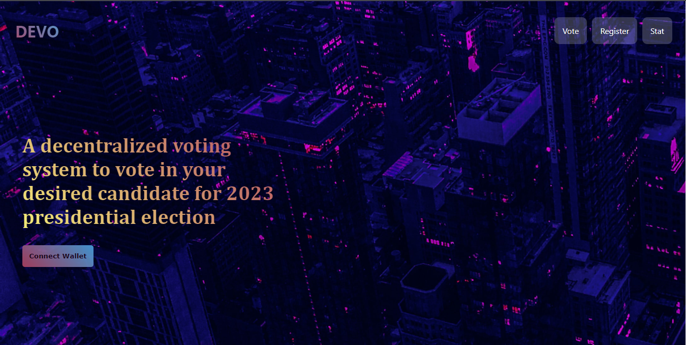

# DEVO

### DECENTRALIZED VOTING APPLICATION

To interact with this project, visit [here](https://devodapp.herokuapp.com).

Project demo can be accessed [here](https://www.loom.com/share/7a1e03f3fe8340ae82df9b2a5494dffc)

Devo is a dapp built on the ethereum blockchain. The smart contract can be found [here](https://github.com/komus-Israel/DEVO-smart-contract) 

The purpose of this client application is to visualize how an application can interact with a smart contract and how DEVO smart contract can be used to solve voting issues.

This application isn't 100% secured as an identity can register with various addresses however the security of a decentralized voting system can improved with the advent of AI. Facial recognition model can be integrated with biometrics to enhance the security of the system.

### HOW THIS SYSTEM WAS BUILT

* Smart contract was written in solidity

* Unit testing and deployment with Truffle

* Client application built with react

* Only the deployer of the contract is authorized to register candidates

* Candidates image assets are stored on pinata IPFS

### HOW TO INTERACT WITH THIS APPLICATION

* Install metamask extension in your browser

* Connect your wallet Address using the Rinkeby test net

* Ensure you have some test ether

* Register to vote your desired candidate

* Once your registration has been approved, you can vote in your desired candidate